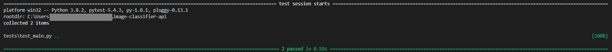

# User Guide

Serving deep learning model thorugh API.

### Installation

Used **fastapi, pytorch, pytorch-lightning** mainly to create this project. You can use requirements.txt to install appropriate package version. First, create a virtual environment before installing any packages.
```
pip install -r requirements.txt
```
>Note: The model was trained on Google Colab with GPU support.

### About Project 

This is a pet project where I wanted to learn FastApi. It's easy to train a new model these days. I also wanted to serve the model through an API. FastApi is very light and Flask like framework.

After googling I found some similar projects but they used keras. As a pytorch fan I used pytorch lightning for the training purpose.

CIFAR10 dataset was used in this project. The dataset was downloaded via torchvision dataset.

The project was designed in such a way that anyone can clone/download and run the projcet without any tweaking.

### How to run the app

After installing necessary packages, use the following command to run the app from project root directory-

```
uvicorn app.main:app
```
And visit **http://127.0.0.1:8000/docs** from your browser. You will be able to see swagger. From there you can upload an image through *predict* endpoint and then you will get a json response.

Use *--reload* argument if you want to change code and see the effect immediately.

>To Run the Test Cases Use *pytest* command from project root directory. Then you will see something similar to this -



### How to run the app with docker

Make sure you are in the project root directory and you have started docker. Then create docker image using the following command.

```
docker build -t image-classifier-api .
```
After the image is successfully built, run the following commands to run the container.

```
docker run -p 5000:80 image-classifier-api
```
And visit **http://127.0.0.1:5000/docs** from your browser. You will be able to see swagger. From there you can upload an image through *predict* endpoint and then you will get a json response.

### Model Training and Performance

Model performance wasn't the main focus of this project. So, I didn't try much to improve the model performance. All the hyperparameters can be found in *config.py* file.

All the files related to training can be found in the *deep_learning_model/training* folder.

### Personal Feedback About The Project

- Naming is an issue that is there. (variable naming, Class naing, module naming, etc). This could have been better.
- There isn't clear seperation between the service and controller layer.
- There is "TorchScript" to take pytorch code to production which is much optimized version.
- The description of this README file isn't enough user friendly.

>NOTE: Please, raise issue if you find an area where it needs some improvement.

### Future Plan

This projects isn't upto the production standard at all. I will be updating this periodically. I have asked few of my seniors to review my codebase and provide feedback.

Though I have plan to work on the following improvements:

- [x] Introducing Docker
- [ ] CI/CD pipeline
- [ ] SonarCloud or Other code quality checking tool/service integration
- [ ] Dependency Injection in FastApi
- [ ] Saving requested images in s3 bucket.
- [ ] deploying the project on AWS or Heroku App

### References:
- [Developing and Testing an Asynchronous API with FastAPI and Pytest](https://testdriven.io/blog/fastapi-crud/)
- [Tutorial: How to deploy your ConvNet classifier with Keras and FastAPI](https://www.machinecurve.com/index.php/2020/03/19/tutorial-how-to-deploy-your-convnet-classifier-with-keras-and-fastapi/)
- [Building a Machine Learning API with FastAPI](https://brandonserna.github.io/fastapi/)
- [TRAINING A CLASSIFIER](https://pytorch.org/tutorials/beginner/blitz/cifar10_tutorial.html)
- [Tutorial - User Guide](https://fastapi.tiangolo.com/tutorial/)
- [How to test a FastAPI api endpoint that consumes images?](https://stackoverflow.com/questions/60783222/how-to-test-a-fastapi-api-endpoint-that-consumes-images)
- [Find current directory and file's directory [duplicate]](https://stackoverflow.com/questions/5137497/find-current-directory-and-files-directory)
